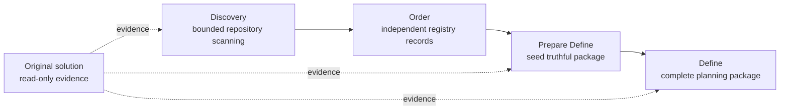
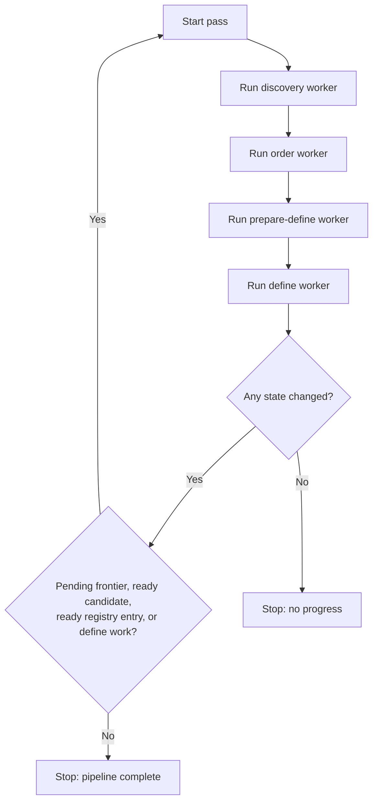

# MAGO Orchestration Flow

Operator/automation reference stored under `assets/`; load only for explicit multi-stage loops.

## Purpose

Run a deterministic sequence that scans an existing solution in bounded batches, extracts evidence, registers concurrent-safe specs, prepares truthful packages, and keeps the original solution read-only.

## Core Principle

The original solution is a behavior/structure truth source, never a planning write target. Read it, document findings, and link planning artifacts back to it; do not modify it or create tasks that implement inside the source solution unless the user explicitly selected that repository as the execution target for downstream MAGIA.

## Stage Pipeline

`discovery -> order -> prepare-define -> define`

### 1. Discovery

Goal: scan one bounded frontier and extract candidate features, entry points, dependencies, evidence, and questions. Artifacts: `discovery-state.json`, `discovery-index.yaml`, `candidates/<candidate_id>.md`. Do not create `spec_id`, registry entries, or package files.

### 2. Order

Goal: turn stable candidates into independent registered planning items. Artifact: one atomically created `registry/<spec_id>.yaml` per genuinely distinct capability. Deduplicate by capability/feature key, select handoff/package shape conservatively, and do not create package folders or edit shared aggregates.

### 3. Prepare Define

Goal: read one registry record plus linked candidates and seed the smallest truthful package under `specs/<spec_id>/`. Preserve original-solution paths as read-only evidence. Do not invent unsupported tasks, scope, dependencies, validation success, or completion.

### 4. Define

Goal: complete one seeded package using ordinary define rules. Preserve registry intent and discovery traceability. Produce executable planning tasks where justified, but do not claim implementation or runtime evidence.

## Python Worker Model

Prefer separate bounded workers, not one monolithic prompt loop.

- Discovery worker: inspect one frontier batch; success means frontier advanced, evidence/candidates updated, or blockers recorded.
- Order worker: register one or more independent evidence-ready candidates; success means at least one registry record created/reconciled or a blocker recorded.
- Prepare-Define worker: process exactly one registry entry whose handoff is ready; success means one identity-consistent seed package or a recorded conflict.
- Define worker: process exactly one seeded package; success means evidence-supported planning progress without execution claims.

## Loop Contract

Continue only while progress is possible: pending frontier items, candidates ready for registration, registry entries ready for preparation, or seeded packages needing definition. Stop after a full pass with no state change.

## Minimal State Expectations

Artifacts must answer:

- next frontier and already-scanned files;
- candidates ready for registration;
- registry records and dependencies;
- blocked handoffs;
- package currently being prepared or defined;
- evidence paths and whether claims are observed or inferred.

Without this state the loop is not resumable or auditable.

## Reference Handling and Failure Policy

Downstream packages keep traceability to source files: list them in notes/traceability, derive behavior statements from evidence, distinguish observed from inferred, and record blockers when behavior cannot be confirmed.

When evidence is weak or contradictory, block the candidate/handoff, preserve confirmed findings, and do not force registration or package completeness. Truthful partial progress is preferable to unstable output.
