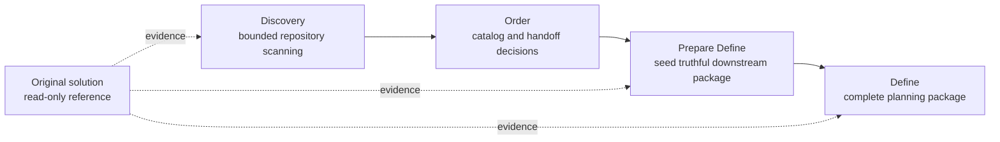
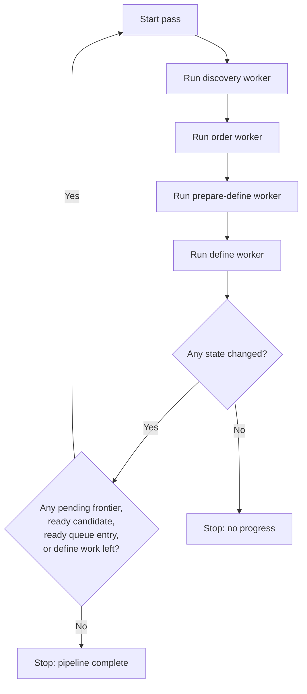

# MAGO Orchestration Flow

Operator/automation reference stored under `assets/`; not default prompt surface.

## Purpose

Deterministic loop: scan existing solution in bounded batches, extract candidate capability/behavior evidence, order candidates into a spec queue, prepare downstream MAGO packages, and keep the original solution read-only.

## Core Principle

Original solution = behavior/structure truth source, never implementation target. Read it, document findings, link MAGO artifacts back to it, but never create tasks that develop inside it or treat its files as writable planning targets.

## Stage Pipeline

`discovery -> order -> prepare-define -> define`

### 1. Discovery

Goal: scan a bounded repository frontier and extract candidate features, entry points, dependencies, open questions. Artifacts: discovery-state.json, discovery-index.yaml, candidates/<candidate_id>.md. Rules: iterative/batch-based; no `spec_id`, ordering, or define package generation.

### 2. Order

Goal: turn stable discovery candidates into ordered planning items. Artifacts: spec-catalog.yaml, define-queue.yaml. Rules: deduplicate by capability boundary, assign stable planning identity, select downstream mode/package shape conservatively, and do not create spec folders or package files.

### 3. Prepare Define

Goal: read one ordered queue entry and seed the smallest truthful define-compatible package. Inputs: one define-queue.yaml entry, matching spec-catalog.yaml entry, linked discovery candidates, referenced original-solution files. Outputs: only package artifacts justified by queue/current evidence. Rules: preserve original-solution references, mark them reference-only, and do not invent unsupported tasks/scope/completion.

### 4. Define

Goal: complete/refine the seed into an ordinary MAGO planning package. Artifacts may include manifest.yaml, prd.md, notes.md, validation.md, tasks.md. Rules: preserve queue intent and discovery evidence, keep implementation out of scope, and document original solution as reference-only.

## Python Worker Model

Prefer separate worker commands per stage, not one monolithic prompt loop.

- Discovery worker: read next frontier batch from discovery-state.json, inspect only that batch, update discovery artifacts, stop after one truthful iteration. Success: frontier advanced, candidate evidence updated, or blockers recorded.
- Order worker: select candidates with enough evidence, reconcile spec-catalog.yaml and define-queue.yaml, stop after one bounded pass. Success: at least one candidate ordered or a blocker recorded.
- Prepare Define worker: select one queue entry with `handoff_status: ready_for_prepare_define`, generate justified seed package, preserve original-solution references, stop after one entry. Success: one downstream-ready seed exists or a blocking conflict was recorded.
- Define worker: select one seeded package, run ordinary define logic, complete only evidence-supported artifacts. Success: one package advances without execution claims or development work.

## Loop Contract

Continue only while progress is possible: pending frontier items, candidates ready for ordering, define-queue entries ready for prepare-define, or seeded packages needing define work. Stop when a full pass produces no state change.

## Minimal State Expectations

Artifacts must answer: next frontier, already scanned files, candidates ready for order, ordered specs, blocked queue entries, and package currently being prepared/defined. Without this state the loop is fragile.

## Reference Handling and Failure Policy

Downstream packages keep traceability to original solution: list original files in notes.md, describe behavior in prd.md from evidence, distinguish inferred vs observed, and record blockers when behavior cannot be confirmed. Recommended wording: "Original solution reference", "Read-only source reference", "Do not implement in the original solution".

When evidence is weak/contradictory: block the item, record why, preserve confirmed findings, and do not force order or package completeness. Truthful partial progress beats unstable output.
