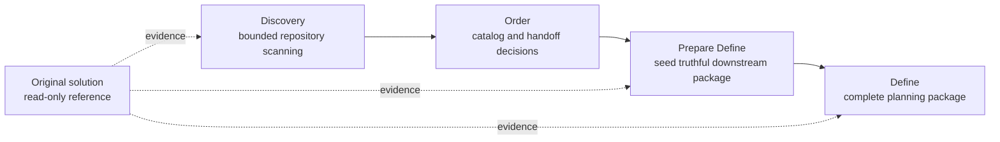
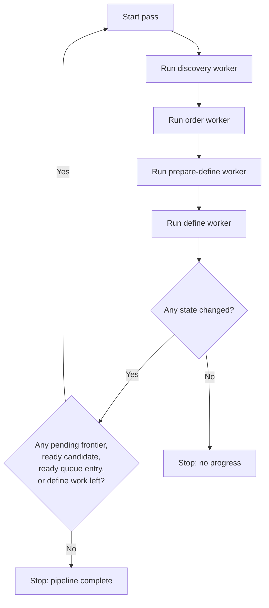

# MAGO Orchestration Flow

This document is intentionally stored under `assets/` so it stays outside MAGO's normal runtime context. Use it as an operator and automation reference, not as part of the default skill prompt surface.

## Purpose

Describe a deterministic multi-step loop that:

1. scans an existing solution in bounded batches,
2. extracts candidate capabilities and behavior evidence,
3. orders those candidates into a spec queue,
4. prepares downstream MAGO planning packages, and
5. keeps the original solution as read-only reference material.

## Core Principle

The original solution is a source of truth for behavior and structure, but it is never the implementation target.

- read from the original solution
- document findings about the original solution
- link MAGO artifacts back to the original solution
- never create tasks that propose development inside the original solution
- never treat original-solution files as writable planning targets

## Stage Model

The orchestration pipeline is:

`discovery -> order -> prepare-define -> define`

Each stage owns a specific artifact boundary.

### 1. Discovery

Goal:
- scan a bounded frontier of repository files
- extract candidate features, entry points, dependencies, and open questions

Artifacts:
- discovery-state.json
- discovery-index.yaml
- candidates/<candidate_id>.md

Rules:
- iterative and batch-based
- no `spec_id`
- no ordering
- no define package generation

### 2. Order

Goal:
- turn stable discovery candidates into ordered planning items

Artifacts:
- spec-catalog.yaml
- define-queue.yaml

Rules:
- deduplicate by capability boundary
- assign stable planning identity
- select downstream mode and package shape conservatively
- do not create spec folders or define package files

### 3. Prepare Define

Goal:
- read one ordered queue entry and seed the smallest truthful define-compatible package

Inputs:
- one define-queue.yaml entry
- matching spec-catalog.yaml entry
- linked discovery candidate docs
- original-solution files referenced by those artifacts

Outputs:
- only the package artifacts justified by the queue entry and current evidence

Rules:
- preserve source references to the original solution
- mark the original solution as reference-only
- do not invent unsupported tasks, scope, or completion

### 4. Define

Goal:
- complete or refine the seeded package into an ordinary MAGO planning package

Artifacts may include:
- manifest.yaml
- prd.md
- notes.md
- validation.md
- tasks.md

Rules:
- preserve the queue intent and discovery evidence
- keep implementation out of scope
- document the original solution as reference material only

## Recommended Python Worker Model

Prefer separate workers or commands per stage instead of one monolithic prompt loop.

### Discovery Worker

Responsibilities:
- read the next frontier batch from discovery-state.json
- inspect only that bounded batch
- update discovery artifacts
- stop after one truthful iteration

Success condition:
- frontier state advanced, candidate evidence updated, or blockers recorded

### Order Worker

Responsibilities:
- select discovery candidates with enough evidence for ordering
- reconcile spec-catalog.yaml
- reconcile define-queue.yaml
- stop after one bounded ordering pass

Success condition:
- at least one candidate moved into ordered downstream handoff or a blocker was recorded truthfully

### Prepare Define Worker

Responsibilities:
- select one queue entry with `handoff_status: ready_for_prepare_define`
- generate the justified seed package
- preserve original-solution references in the package
- stop after one queue item

Success condition:
- one downstream-ready package seed exists or a real blocking conflict was recorded

### Define Worker

Responsibilities:
- select one seeded package
- run ordinary MAGO define logic
- complete only the artifacts supported by evidence

Success condition:
- one package is advanced without inventing execution claims or development work

## Loop Contract

The automation loop should be progress-based, not blindly infinite.

Continue while at least one of these is true:
- discovery has pending frontier items
- discovery produced candidates ready for ordering
- define-queue.yaml has entries ready for prepare-define
- seeded packages still need define work

Stop when a full pass produces no state change.

## Minimal State Expectations

The orchestrator should be able to answer:
- what frontier is next
- what was already scanned
- which candidates are ready for order
- which specs are ordered
- which queue entries are blocked
- which package is currently being prepared or defined

If these answers are not visible in artifacts, the loop will become fragile.

## Reference Handling Rules

Every downstream package should keep traceability back to the original solution.

Recommended practice:
- list original-solution files in notes.md
- describe behavior in prd.md using evidence derived from those files
- keep wording explicit when something is inferred versus directly observed
- record blockers when behavior cannot be confirmed from the source

Recommended wording:
- "Original solution reference"
- "Read-only source reference"
- "Do not implement in the original solution"

## Suggested Failure Policy

When evidence is weak or contradictory:
- block the item
- record the reason
- preserve all already confirmed findings
- do not force ordering or package completeness

Truthful partial progress is preferred over unstable output.

## Operational Summary

Use discovery to learn.

Use order to decide sequence and downstream shape.

Use prepare-define to translate ordered evidence into a define-ready package.

Use define to finish planning artifacts.

Use the original solution as read-only reference throughout the entire flow.
